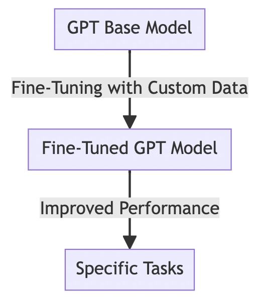
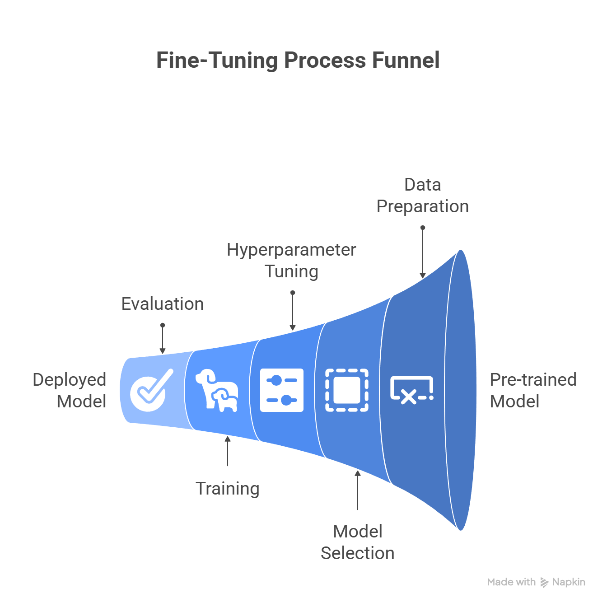

# Week 11: Fine-Tuning Language Models

## Overview
This week focuses on the process of fine-tuning large language models (LLMs) like GPT-2 for domain-specific tasks. The materials include a lab PDF, two practical Python notebooks, and two key images illustrating the conceptual and technical flow of fine-tuning.

---

## Key Concepts
- **Fine-tuning** adapts a pre-trained model to perform better on a specific dataset or task.
- The process involves data preparation, model selection, training, evaluation, and hyperparameter tuning.

---

## Visual Summaries

- 
  - *This image shows how model performance improves as you move from a generic GPT-based model to a fine-tuned model specialized for a particular task.*

- 
  - *This diagram outlines the technical workflow: starting from a deployed GPT model, moving through evaluation, training, hyperparameter tuning, model selection, data preparation, and leveraging a pre-trained model.*

---

## Lab PDF Reference
- **CSET419_Lab11_FineTuning.pdf** provides theoretical background and practical instructions for fine-tuning LLMs, including:
  - The rationale for fine-tuning vs. training from scratch
  - Steps for preparing data and configuring the training process
  - Evaluation metrics and best practices

---

## Practical Experiments

### 1. GenAI_Exp11_ECommerce.ipynb
- **Goal:** Fine-tune GPT-2 to generate product reviews for e-commerce.
- **Steps:**
  1. Load and prepare the GPT-2 model and tokenizer.
  2. Generate baseline reviews using the pre-trained model.
  3. Prepare a dataset of real product reviews.
  4. Fine-tune the model on this dataset.
  5. Evaluate and compare the model’s outputs before and after fine-tuning.

### 2. GenAI_Exp11_FoodTech.ipynb
- **Goal:** Fine-tune GPT-2 to generate cooking recipes.
- **Steps:**
  1. Reload a fresh GPT-2 model and tokenizer.
  2. Generate baseline recipes from prompts.
  3. Prepare a dataset of step-by-step recipes.
  4. Fine-tune the model on the recipe dataset.
  5. Evaluate and compare recipe generation before and after fine-tuning.

---

## How to Use
1. Review the PDF for theoretical context and step-by-step instructions.
2. Explore the images for a conceptual and technical overview of the fine-tuning process.
3. Run the notebooks to see practical fine-tuning in action for both e-commerce and food tech domains.

---

## Learning Outcomes
- Understand the end-to-end process of fine-tuning LLMs.
- Gain hands-on experience with data preparation, model training, and evaluation.
- Learn to interpret improvements in model performance after fine-tuning.

---
