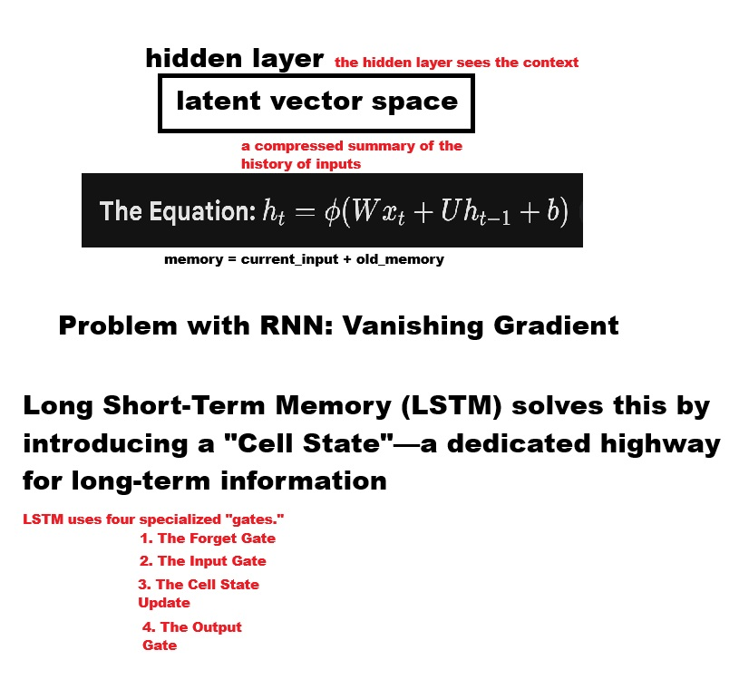

# Recurrent Neural Networks (RNN) for Text Generation



This document explains the code and concepts behind the **RNN/LSTM Model** used in `GenAI_Exp4_RNN.ipynb`.

---

## 1. The Concept

### The Problem with N-Grams (Memory)

In the previous N-Gram model, we used a "Sliding Window".

- **Window Size 3**: To predict the 4th word, we _only_ looked at the previous 3 words.
- **Limitation**: If the important context was 20 words ago (e.g., "Alice is a girl... [20 words later] ... **she**"), an N-Gram model would forget it. It has no long-term memory.

### The RNN Solution (Mental State)

A **Recurrent Neural Network (RNN)** works like a human reading a sentence.

1.  You read the first word.
2.  You update your "mental state" (memory) based on that word.
3.  You read the next word, and update your mental state again, combining the _new word_ with your _existing memory_.

This allows the model to theoretically remember things from the very beginning of the sentence.

### The "Telephone Game" & LSTM

Standard RNNs have a problem: as the sentence gets longer, the memory fades or gets distorted (like the game of "Telephone"). This is called the **Vanishing Gradient problem**.

**LSTM (Long Short-Term Memory)** is a smarter RNN. It has a "gatekeeper" that decides:

- What to **keep** in memory.
- What to **forget** (e.g., old information that's no longer relevant).
- What to **pay attention to** right now.

---

## 2. Code Walkthrough

This section changes gears from simple stats (N-Grams) to Deep Learning (TensorFlow/Keras).

### Step 1: Data Preparation & Tokenization

Neural Networks cannot understand text. They only understand numbers.

```python
tokenizer = Tokenizer()
tokenizer.fit_on_texts([corpus_text])
# "Artificial" -> 1, "Intelligence" -> 2
```

**Padding**:
Neural networks expect inputs of the _exact same length_.

- Sentence A: "Hi" (Length 1)
- Sentence B: "Hello world" (Length 2)
  We add "padding" (zeros) to make them equal:
- Sentence A: `[0, 1]`
- Sentence B: `[2, 3]`

### Step 2: The Model Architecture

We build the brain using `Sequential()` layers.

```python
model = Sequential()

# 1. Embedding Layer
# Converts the integer '1' into a vector like [0.2, -0.9, 0.5, ...]
# This allows the model to learn that "King" and "Queen" are similar directions in math space.
model.add(Embedding(total_words, 64))

# 2. RNN/LSTM Layer
# The core memory layer.
# It loops through the sequence, updating its internal state at each step.
model.add(SimpleRNN(100))
# OR model.add(LSTM(100)) <- Better for long text

# 3. Output Layer (Dense)
# A standard layer that looks at the final "mental state" and predicts the next word.
# Softmax turns the output into Probabilities (summing to 100%).
model.add(Dense(total_words, activation='softmax'))
```

### Step 3: Training

```python
model.compile(loss='categorical_crossentropy', optimizer='adam', metrics=['accuracy'])
model.fit(X, y, epochs=100)
```

- **Loss (categorical_crossentropy)**: Measures how wrong the prediction was.
- **Optimizer (adam)**: Adjusts the brain's connections (weights) to reduce the error.
- **Epochs**: How many times we read through the entire dataset.

### Step 4: Generation

Generating text with an RNN is a loop:

1.  Take `seed_text` (e.g., "Artificial").
2.  Convert to sequence `[1]`.
3.  Ask model to predict next word -> gets `intelligence` (Index 2).
4.  **Update Seed**: New seed is "Artificial intelligence".
5.  Repeat!

```python
def generate_text_rnn(..., next_words, ...):
    for _ in range(next_words):
        # ... predict next word ...
        seed_text += " " + output_word
    return seed_text
```

### Summary of Differences

| N-Gram      | RNN / LSTM                        |                                     |
| ----------- | --------------------------------- | ----------------------------------- |
| **Logic**   | Frequency counting (Statistics)   | Learning patterns (Deep Learning)   |
| **Context** | Fixed window (e.g., last 2 words) | Flexible "Memory" state             |
| **Pros**    | Fast, simple, transparent         | Better coherence, learns "concepts" |
| **Cons**    | No long-term memory               | Slower to train, needs more data    |
