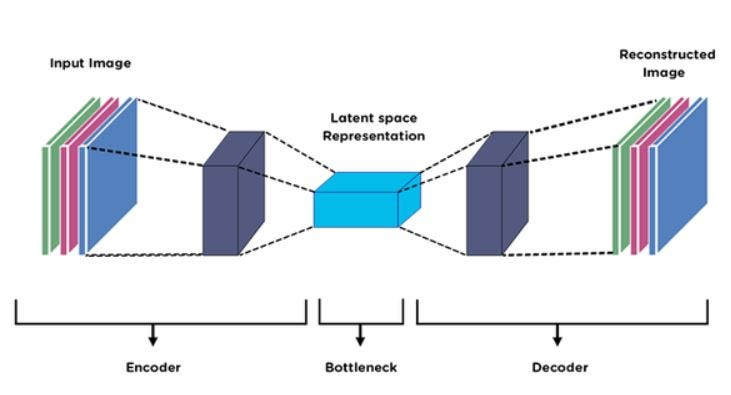
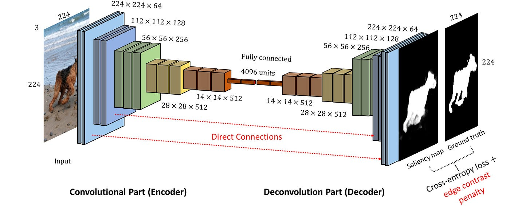

# CSET419- Introduction to Generative Al: Lab-5

## Objective

To implement a baseline encoder-decoder CNN for paired image-to-image translation and analyze its performance using reconstruction loss. This acts as a Baseline CNN for Image-to-Image Translation (Encoder-Decoder without GAN).

## Dataset

We use the **CIFAR10** dataset for this experiment.

---

## Code Explanation: Step-by-Step

### 1. Load Paired Images & Normalize

Neural networks perform better when input data is normalized. CIFAR10 images have pixel values ranging from $0$ to $255$. When converted to PyTorch tensors, they are scaled to $[0, 1]$.
To normalize the images to the required $[-1, 1]$ range, we apply `transforms.Normalize((0.5, 0.5, 0.5), (0.5, 0.5, 0.5))`. This subtracts $0.5$ (mean) and divides by $0.5$ (standard deviation) for each of the 3 RGB channels.
We then use `DataLoader` to load the dataset in batches (e.g., 64 images per batch) to feed into our model during training. Since this is an autoencoder reconstruction task, the "paired" image is the input image mapped to itself.

### 2. The Encoder-Decoder CNN Architecture

The core of this lab is the model architecture, which consists of two main parts:

- **Encoder:** This part compresses the input image into a smaller, dense representation (latent space). It uses `Conv2d` layers with a stride of 2, which halves the spatial dimensions of the image (e.g., from $32 \times 32$ down to $16 \times 16$, then $8 \times 8$) while increasing the number of feature channels. ReLU activation functions are used to introduce non-linearity.
- **Decoder:** This part takes the compressed representation and reconstructs it back to the original image dimensions. It uses `ConvTranspose2d` layers (often called deconvolutional layers) with a stride of 2 to upscale the spatial dimensions back to $32 \times 32$.
- **Final Activation:** The last layer of the decoder uses a `Tanh` activation function. `Tanh` squashes the output values to be between $[-1, 1]$, which perfectly matches the normalization we applied to our input images.

### 3. Compute MSE Loss

To train the model, we need to measure how far off its reconstructions are from the original images. We use **Mean Squared Error (MSE)** loss (`nn.MSELoss()`). MSE calculates the squared difference between the predicted pixel values and the actual pixel values.
We use the **Adam optimizer** (`optim.Adam`) to update the network's weights based on the calculated loss to minimize this error over time.

### 4. Train Encoder-Decoder CNN

During the training loop, the model goes through several epochs (full passes over the dataset). For each batch:

1.  **Forward Pass:** The images are passed through the encoder and decoder to generate reconstructed images.
2.  **Loss Calculation:** The MSE loss is calculated by comparing the reconstructions to the original images.
3.  **Backward Pass:** Gradients are computed using `loss.backward()`.
4.  **Optimization:** The optimizer updates the model's weights using `optimizer.step()` to improve future predictions.

### 5. Visualize Translated Images & Expected Output

After training, we visualize the original images alongside the model's reconstructed translations. Before plotting, we must un-normalize the tensors (converting them back from $[-1, 1]$ to $[0, 1]$) so `matplotlib` can display them correctly.

**Why are the output images blurry?**
The expected output images are blurry because the model is trained exclusively using MSE loss. MSE penalizes the model based on strict pixel-to-pixel differences. When the model is uncertain about high-frequency details (like sharp edges, textures, or exact colors), predicting a sharp but slightly misplaced edge results in a massive penalty. To minimize this penalty safely, the network predicts the mathematical average of the possible pixel values. This averaging inherently creates a blurry, smooth image. This limitation of MSE loss is the primary reason why Generative Adversarial Networks (GANs) were introduced for image generation tasks!
