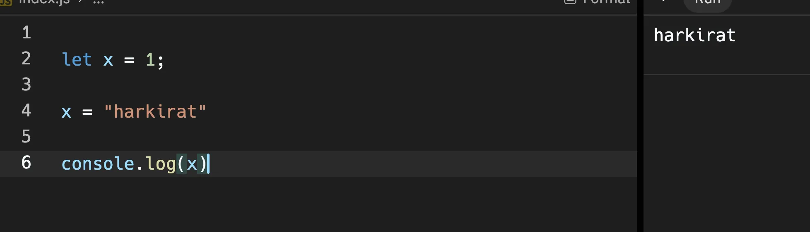
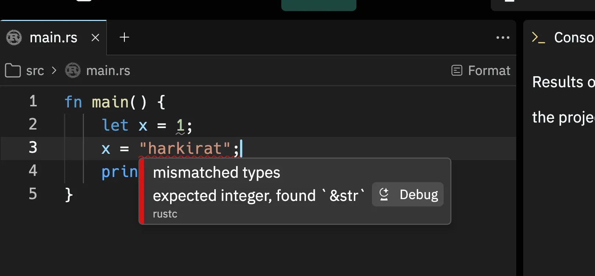
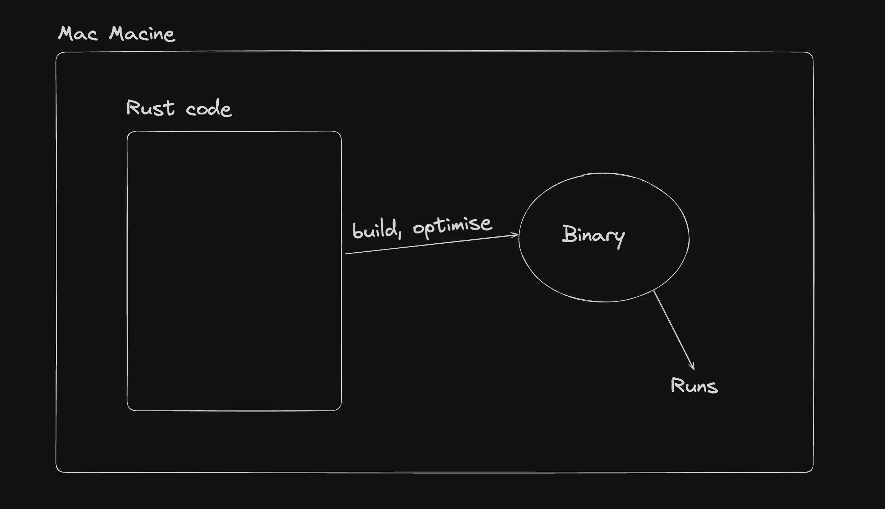
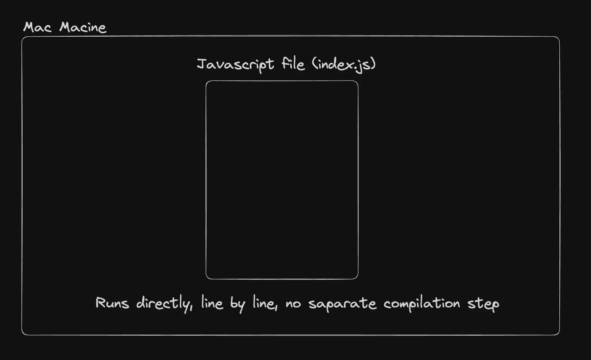

# Why rust? Isn’t Node.js enough?

## Type safety
Javascript:

Rust:

`💡Typescript was introduced to get rid of some of these problems in JS`

## Systems language
It is intended to be used (but not restricted to) to do lower level things
1. Building a Compiler
2. Building a browser
3. Working closer to the OS/kernel

## Generally faster
Rust has a separate compilation step (similar to C++) that spits out an optimised binary and does a lot of static analysis at compile time.

JS does JIT compilation. 

## Concurrency
Rust has built-in support for concurrent programming allowing multiple threads to perform tasks simultaneously without risking data races

Javascript is single threaded generally (there are some projects that tried making it multi threaded but rarely used)
 
## Memory safe
Rust has a concept of owners, borrowing and lifetimes that make it extremely memory safe
 
`💡 Rust doesn't hide complexity from developers it offers them the right tools to manage all the complexity.`